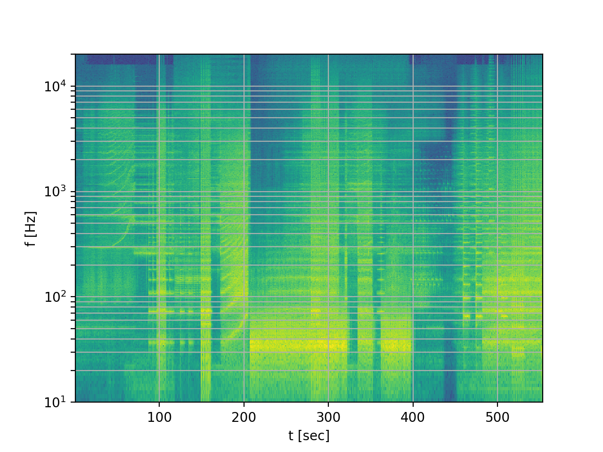

# soundspec
spectrum visualizer for audio files; uses the Fourier transform

Requires Python 3 and a few typical number crunching modules. Install the modules and run the `soundspec.py` script as is. It should be self-explanatory. Only works on WAV files, so use VLC or ffmpeg to convert your file to WAV first.

There's an .sh file and a .bat file for batch processing - analyzing many files with one command. Those require ffmpeg, and can analyze any type of audio file - MP3, M4A, FLAC, etc, if it's supported by ffmpeg, it will probably work.

The core part of the script is the Fourier transform done via `scipy.signal.spectrogram()`. I have not done any automation around the file parameters, but it should work with typical audio files containing music. Open an issue on GitHub if something doesn't work as it should, or hack the code and send me a pull request.

Currently, the frequency resolution is about 1 Hz (in the bottom part of the spectrum), and time resolution is about 1 second. Details finer than those limits will seem smeared. Resolution could be increased, but at the cost of increasing the run time of the app.

## For Windows 10 users (Mac version will follow soon, I hope)

If you don't want to mess with Python scripting, there's an .exe for Windows you could download. Click the [releases](https://github.com/FlorinAndrei/soundspec/releases) link at the top of the page and download the most recent version. Extract the zip archive in some convenient folder - I prefer something like `C:\opt\soundspec` but that's up to you.

Within the archive you'll find two executables: `soundspec.exe` and `soundspec-batch.bat`.

### Analyzing one file at a time

`soundspec.exe` is for making the spectrum of a one or more files. It only works on WAV files. Example:

```
soundspec.exe "C:\Users\darkstar\Music\latest hit.wav"
```

You must run it from the Command Prompt. Open cmd.exe, navigate to the place where you've extracted the zip archive, and run the app as shown above. Provide the full path to the music file, and use double quotes.

There's no GUI initially, sorry; a simple GUI will open to show you the spectrum image, but that's all. You can save the image from the GUI, or zoom in, scroll, etc.

It should not take more than a couple seconds to analyze a file, in most cases.

### Analyzing many files at once

First you need to install [ffmpeg](https://ffmpeg.org/). The Windows version is currently [on this page](https://ffmpeg.zeranoe.com/builds/). I suggest you avoid the nightly builds, and stick to the release builds instead.

Download and install it in a place such as `C:\opt\ffmpeg`. Then [add the bin directory to the PATH](https://helpdeskgeek.com/windows-10/add-windows-path-environment-variable/) - it should look like `C:\opt\ffmpeg\bin`. Then if you open the Command Prompt and type "ffmpeg", it should run it no matter in which folder you are currently. That's a requirement.

Download the music files you want to analyze, and place them in any directory. Open a Command Prompt, go to the soundspec folder, and run the batch script with the full path to the folder containing your music files. Example:

```
soundspec-batch.bat "C:\Users\darkstar\Music\Bananas album"
```

It will take a few seconds to analyze each song. Next to the songs you'll find PNG files with the spectral analysis for each song. If you give it thousands of files, it may take hours to complete; it will not overload your system since only one song is processed at any given time.

There's no GUI at all in batch mode. Almost any audio file format is supported in this mode, including MP3, M4A, FLAC, etc. Feel free to mix and match different file types.

## For Ubuntu users

Install any missing python 3 libraries, e.g. scipy and numpy, as follows:

```
sudo apt install python3-scipy
sudo apt install python3-numpy
```

### Analyzing one or more files at a time

`soundspec.py` is for making the spectrogram of one or more files. It only works on WAV files. Example:

```
python3 soundspec.py "/home/darkstar/Music/latest hit.wav"
python3 soundspec.py "/home/darkstar/Music/*.wav"
```

You must run it from a unix shell. Open a terminal application, navigate to the place where you've extracted the zip archive, and run the app as shown above. Provide the full path to the music file, and use double quotes if the path names contains any blanks.


## Output example
Here's an output sample from running the app on a WAV file:

```
$ ./soundspec.py joker.wav 
joker.wav: reading ...
joker.wav: processing ...
joker.wav: calculating FFT ...
joker.wav: generating the image ...
```

This is the image that was generated. The horizontal axis is time (in seconds). The vertical axis is frequency (in Hz). The colors represent sound intensities - blue is quiet, yellow is loud.



It's the spectrum of the song ['Why So Serious?'](https://www.youtube.com/watch?v=1zyhQjJ5UgY) by Hans Zimmer and James Newton Howard, from the movie 'The Dark Knight'.

The song is semi-famous among "audiophile" enthusiasts, where it is considered a good test of bass response for audio systems. The portion of interest begins shortly after 200 sec (3 min 24 sec, more or less). You can see a lot of energy is focused between 30 Hz and 40 Hz. While pretty low, these are not actually extremely low frequencies - there are songs out there with deeper bass, closer to 20 Hz in some cases. But if your speakers or headphones can play those notes, they are alright.

## Notes

Discussion thread about this app on the Audio Science Review forum:

https://www.audiosciencereview.com/forum/index.php?threads/simple-app-to-visualize-the-spectrum-of-a-whole-song-or-many-songs-in-batch-mode-from-start-to-end-in-one-image-bonus-remember-why-so-serious.8462/

### Multiprocessing

To speed up creation of multiple spectrograms in batchmode soundspec uses all available CPU cores to process the data in parallel (reading is not parallelized). If there are many big audio files the memory may not be sufficient. In this case run soundspec with option -s to force single processing mode.
